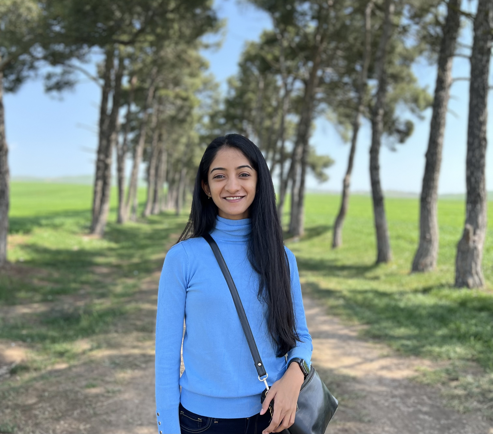

# Welcome 👋

  

Hi, I’m **Vaishnavi** - a data engineer and graduate student who enjoys building reliable data systems that turn complex information into clear, actionable insights.

I’m currently pursuing a **Master of Information Systems Management at Carnegie Mellon University**, and I bring **8+ years of industry experience** working across large-scale data platforms, analytics engineering, and financial systems. My work sits at the intersection of **data engineering, product thinking, and decision-making**, with a strong focus on trust, governance, and real-world impact.

---

## What I Work On

Over the years, I’ve designed and built:

- **Scalable data platforms** supporting analytics, financial reporting, and compliance  
- **Distributed data pipelines** processing millions of records for product and customer insights  
- **SOX- and CCPA-compliant data systems** that balance speed with regulatory rigor  
- **Analytics-ready data models** that enable self-service reporting and experimentation  
- **AI-enabled internal tools**, including early prototypes using retrieval-augmented generation (RAG)

I’ve worked closely with engineers, analysts, finance teams, auditors, and product partners—often translating ambiguous business questions into robust technical solutions.

---

## How I Think About Data

I care deeply about **data quality, usability, and accountability**. To me, good data engineering isn’t just about moving data fast—it’s about making sure people can *trust* it, *understand* it, and *use* it to make better decisions.

---

## Beyond Work

Outside of classes and projects, I enjoy mentoring, collaborating in team-based environments, and learning how technology intersects with organizational processes and public outcomes. I’m motivated by work that has **clarity of purpose**, whether that’s improving financial transparency, enabling better products, or supporting more informed decision-making.

I am also an avid trekker and I have completed several high-altitude Himalayn treks back in India and Nepal. I love adventures that allow me to challenge myself and be amidst nature. 

---

Feel free to explore my projects or reach out if you’d like to connect.
